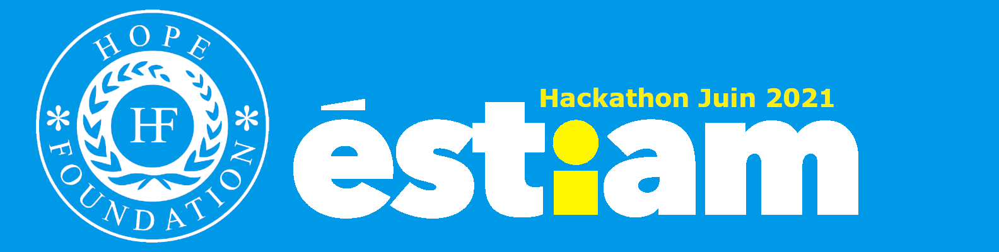

# hackathon-june-2021

# hackathon-mars-2021
Projet Hackathon Juin 2021 de l'école ÉSTIAM. 

## There is our Second Hackathon project of 2021.

We aiming to create the a website with Wordpress and an Android app with Android Studio.

## About our project

## Contributors

| Contributors | profile link |
| ------ | ------ |
| Ludwig | [Profile](https://github.com/LeDeutsch)  |
| Clément | [Profile](https://github.com/grabux)  |
| Alaric | [Profile](https://github.com/Ewerav)  |
| Grâce | [Profile](https://github.com/grace848)  |

## About us

We from France and are currently student at ÉSTIAM.
Young dev trying to improve our skills and to become stronger enough to help the community.

